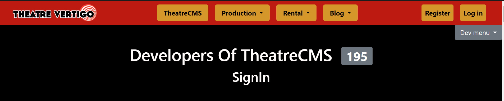
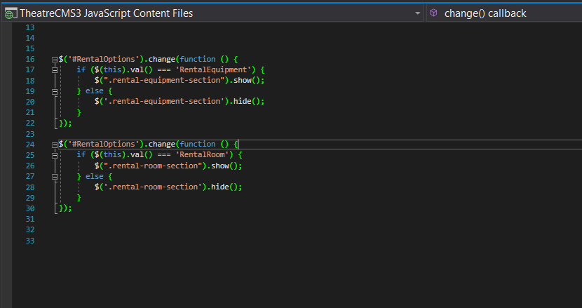

# -CSharp-CRUD-For-Theater-Website

# Introduction
During this two-week sprint, I worked on an ASP.NET MVC C# project with a code-first Entity Framework Database. I worked on a project in the middle of its lifecycle for a local theater's website. I worked on the back end and front end of the CRUD for the create and edit pages. There were different stories describing the tasks that needed to be completed through Azure DevOps. We used the Agile process by having daily stand-ups with other developers discussing roadblocks, what we worked on yesterday, and what we will be working on that day. At the end of each week we had code retrospectives. This allowed me to see how other developers were able to solve problems, create features, and see how all the different functions of the program come together working with a team. 

## First tasks: Use JavaScript to count the number of names of the developers that have worked on this project and display them next to the title and to use a bootstrap badge to style the number. (FrontEnd)

### Code for first task 
The span with id="NumPersons" is so that it may be dynamically updated with JavaScript to display a number of developers. The classes "badge" and "badge-secondary" are used in Bootstrap to style the span as a badge with a secondary appearance.

### Code for the JavaScript to count the numbers of devs.

## Second task: create entity model for Rental and CRUD pages. (BackEnd)
This required me to create an enity model for the Rental class so that rentals can be saved to the database. I created the Rental class along with RentalEqupiment and RentalRoom classes. RentalEqupiment and RentalRoom inherits from Rental. After that, I created the controller(determines what response to send back to a user when a user makes a browser request) and scoffolded (generating a generic application) the CRUD pages for it. I used the EnitityFramework to create the Index, Edit, Create, Details and Delete pages and added the Layout.cshtml as a layout page. 

 ### Code for classes
 .png)

Using NuGet Package Manager Console, I was able to update the database to create the table with the rental, RentalEquipment and RentalCost. This program had automatic migrations enabled. Within the Controllers, I then added a new MVC5 Controller with views using Entity Framework, including a layout page. This created the neccessary CRUD pages for create and edit pages.

## Third task: style the create and edit page. (FrontEnd)
- I Added a header above the form with "Create Rental" on a single line.
- I styled the Submit and Back to List Buttons with a color distinction between the two.
- I added placeholders to all input fields
- I changed the input fields border so when clicked it would match the theme of the website and the color input field to change when clicked as well.

### Code for the form group
This generated a form group that contains a label and an input control for the "RentalName, RentalCost and FlawsandDamages" properties of the model, along with a validation message that displays any error related to the those properties.

### Code for the Submit and BackTo
This is a Razor code that generates an HTML anchor (link) element for returning to a list of items. It creates an action link that displays the text "Back to List" and when clicked, it will redirect the user to the "Index" action in the current controller. The link has an HTML class attribute "btn rental-create--BackToListButton" that can be used to style the link using CSS.

### CSS for first task/all the forms

## Fourth task: Create & Edit for inherited classes. (FrontEnd & BackEnd)
I created a dropdown on the Create and Edit pages for selecting one of the Rental types. Depending on what the user chooses in the dropdown, it shows/hides the input fields in the form.

### Code for creating the instances of the classes
This code sets the ViewBag.Title property to "Create", sets the layout page to "~/Views/Shared/_Layout.cshtml", and creates instances of the classes RentalEquipment and RentalRoom.
For the RentalEquipment instance, it retrieves the values of the properties ChokingHazard, SuffocationHazard, and PurchasePrice and assigns them to local variables with the same name.
For the RentalRoom instance, it retrieves the values of the properties RoomNumber, SquareFootage, and MaxOccupancy and assigns them to local variables with the same name.

### Code for dropdown
The method is used to bind the drop-down list to a model property, in this case "RentalOptions".
The second argument to the method creates a SelectList with the values obtained from Enum.GetValues(typeof(RentalEnum)), where "RentalEnum" is an enumeration type.
The third argument to the method sets the prompt text to "Rental Options". The prompt text is the default text that appears in the drop-down list before an item is selected.

### Code for showing/hiding the input fields
These two codes below creates a section of the form that displays information for the different properties of RentalEquipment and RentalRoom. The section is hidden by default, indicated by the "style" attribute with "display: none;". The section contains a form group with a label and an editor for the "ChokingHazard" model property, and a validation message to display any errors.

Then this is the JavaScript for it to show and hide when clicked.

### Code for the Controller
The method takes in several parameters, including the "Rental" model object, several optional integer values (PurchasePrice, RoomNumber, SquareFootage, MaxOccupancy), and two optional boolean values (ChokingHazard, SuffocationHazard).

The method first checks if PurchasePrice > 0. If so, it creates a new "RentalEquipment" object, sets its properties to the values of the corresponding properties of the "Rental" object, and adds it to the database. Then it returns a redirect to the "Index" action.
If RoomNumber > 0, the method creates a new "RentalRoom" object, sets its properties to the values of the corresponding properties of the "Rental" object, and adds it to the database. Then it returns a redirect to the "Index" action.
If the ModelState is valid, the method adds the "Rental" object to the database and returns a redirect to the "Index" action.
If none of the conditions are met, the method returns the original view with the "Rental" model object passed as the parameter.

## Skills learned
- I learned to look up more specific questions by using key terms in the actual code while searching the question instead of asking a broad overall question and digging and digging for an answer which wasn't using my time efficitantly.

- Utilized version control features more effectively to avoid merge conflicts and outdated local repositories by pulling from the master and merging into my current local repository.

- Used Microsoft Azure DevOps to manage user stories/tasks and learned the aspects of the workflow. This showed me every step of the project along with was what had been completed and once done what should be completed next. This made it transparent for where I am and where/how other developers were approaching their tasks.

- Worked with a project manager to ensure tasks being completed and files being edited were not in conflict with work other developers were completing.

- Gained real-life project experience and was able to see how Agile practices work in a practical work setting.

- Participated in aspects of Agile / SCRUM Practices:
  - 1 Sprint Planning Meeting
  - 8 Daily Stand-ups
  - 2 Code Retrospectives

